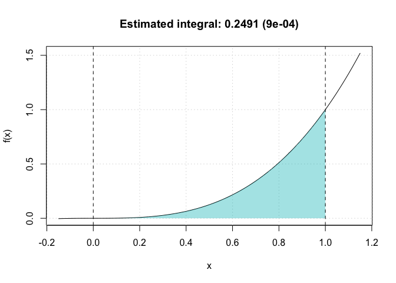

# Monte Carlo integration

Can integrate functions….

# Installation

``` r
devtools::install_github("stephaneguerrier/demo")
```

# What it does

``` r
library(inclassdemo)
obj = mc_int(x_range = c(0,1), fun = "x^2", B = 10^5)
plot(obj)
```

<!-- -->
